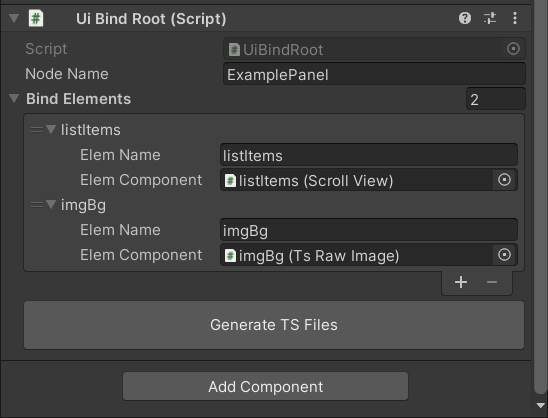
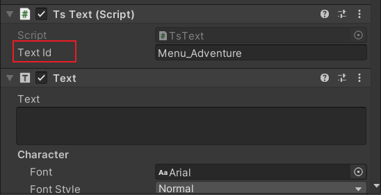

# Create A Panel

## Base Steps

1. Create root node of a panel

   

2. Create Contents

   Create the content of the panel, Use components in TS_UI and UI folders

   Custom Components in TS_UI folder are more efficient than default UI components

3. Bind Dynamic Components

      Dynamic means that these components will be accessed in TS code

      - TsImages/TsRawImages
        
        if their textures will be changed by TS code at Runtime
        
      - Buttons/Sliders 
        
        their trigger events should be handled in TS code
        
      - Other Custom Components
        
        such as TsContainerView/TsScrollView
        

      Bind Operation as below

      

4. Generate TS Files

      

      Click "Generate TS Files" button on the root node of the panel

      ExamplePanelBinder.ts will be generated in ProjectRoot\TsProj\src\UI\PanelBinders\ and is **readonly**

      ExamplePanel.ts will be generated in  ProjectRoot\TsProj\src\UI\Panels\, **but only if it doesn't exist yet**

5. Complete Config

      Save prefab to ProjectRoot\Assets\Resources\UI\Prefabs\Panels\

      Edit  ProjectRoot\Assets\Resources\TsConfigs\PanelConfig.json

      Add config  for the new panel in field data_list

      add id to enum EPanelId in UIDefine.ts file

      | field name | operation                                    |
      | ---------- | -------------------------------------------- |
      | id         | unique panel id                              |
      | clsName    | equals to the name of the TS panel file      |
      | prefab     | equals to the name of the prefab             |
      | layer      | refer to enum  EUILayer in  UIDefine.ts file |

6. Implement Game Logic

   the skeleton of panel file is auto generated, follow these steps and advances tips to fulfill your logic

      ``` typescript
      // change EPanelId.None to correct enum value
      static panelId: EPanelId = EPanelId.None
      // fill the handle logic in OnClick and OnSlider
      ```
   

## Advanced Tips

### Translated Text

To support internationalization, text content should not be configured in prefab or written in code  directly, instead using text id a common solution.

All text are configured in ProjectRoot/Assets/Resources/TsConfigs/Text.json

add TsText component for text unchangeable at runtime

in this situation, text does **not** need to be bound to uibindroot/uibindnode



change the text content at run time

in this situation, TsText component is not needed and Text component is bound

```typescript
//configured in text.json
//"Hero_name_1001": "Knight",
//"sell_price": "sell price: {0}"

//this.data.id == 1001
this.binder.txtHeroName.text = GetText(`Hero_name_{this.data.id}`) 
this.binder.txtPrice.text = FormatText('sell_price', 100)
```


### Event System

``` typescript
private _handlerId : number    
OnInit() {
    //Register handler to Event Center, bind(this) is necessary sometimes
    this._handlerId = RegEventHandler(EEventID.None, this.onEventTest.bind(this))
}
OnClose() {
    // Unregister handler
    this._handlerId = UnregEventHandler(this._handlerId)
}
```

### Timer

```typescript
private _timerId : number
OnShow() {
    //execute this.tick every 1000ms
    this._timerId = AddTickTimer(1000, this.tick)
    //execute this.callOnce for one time after 1000ms
    this._delayId = AddDelayTimer(1000, this.callOnce)
}
OnHide() {
    //cancel tick, can also be called in other functions
    this._timerId = RemoveTimer(this._timerId)
    //cancel delay
    this._delayId = RemoveTimer(this._delayId)
}
```

### Nested UiBindNode

bind element in UiBindRoot can be a UiBindNode

components in UiBindNode are used in the same way as top compoennts


### Create A Widget

Widget is a smaller unit for display,  it's similar to a panel but without a canvas

Widget is a wise choice if the same display is used in different panels

Creating a widget is exactly same as creating a panel except:

- in step 1, click "Ts Widget" instead of "Ts Canvas"
- in step 4, no panel file is generated, widget binder file is generated to ProjectRoot\TsProj\src\UI\WidgetBinders\
- skip step 5 && step 6

