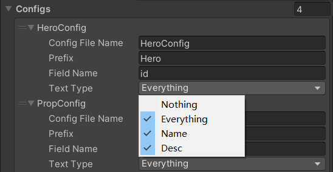

# Create An Item

In this framework, nearly all data are treated as items which are stored in their belonged bags and managed by [ItemMgr.ts](../TsProj/src/Mgrs/ItemMgr.ts)

## Structures

For an item, there are few important properties

| field name | description                                         |
| ---------- | --------------------------------------------------- |
| Item Type  | determines which bag it belongs to                  |
| Key        | an item can be easily accessed by it's type and key |
| base       | dynamic attributes of a specific item               |
| config     | static attributes of a specific item                |

For some item types, there will be multiple items and each has a unique key for accessing

These items derive from [Base Item](../TsProj/src/Item/Base/BaseItem.ts)

Whereas there will be only one item for some item types which are called Singleton

These items derive from [Singleton Item](../TsProj/src/Item/Base/SingletonItem.ts) and key is 0

```typescript
//get item by item type and key
const propItem = GetItem<PropItem>(EItemType.Prop, id)
//get singleton item
const adventure = GetItem<AdventureItem>(EItemType.Adventure)
```

**steps to add a new type of item**

1. Add the new item type to enum EItemType in file [ItemDefine.ts](../TsProj/src/Define/ItemDefine.ts)
2. Add a class file for the new item type in [Items Folder](../TsProj/src/Item/Items/)

A typical item class is like [PropItem.ts](../TsProj/src/Item/Items/PropItem.ts)

## Attributes

all attributes of an item is split into 3 categories:

### static

static attributes are constant values shared by many items with identical sid

these data can be accessed by functions like GetXXXConfig which can be called in any place

but declare a config field in item class is more convenient

```typescript
const propItem = GetItem<PropItem>(EItemType.Prop, index)
//use config
item.itemIcon.imgIcon.SetTexture(propItem.config.icon)
//without config
const propConfig = GetPropConfig(propItem.Key)
item.itemIcon.imgIcon.SetTexture(propConfig.icon)
```


### dynamic

dynamic attributes are unique to each item and usually received from server

these attributes are important and should not be accessed or even changed directly by other modules

classes derived from BaseAttr are used to keep dynamic attributes in an item

attributes can only be altered by  public functions which are decorated with @AttrSetter

this decorator will be explained in below

### cached

all relevant values can be calculated with dynamic and static attributes of an item

but reduplicate calculation is performance killer, so cache is introduced to tackle this

```typescript
readonly attr_list: CachedValue<AttrPair[]>
constructor(sData: HeroItemMsg) {
    this.attr_list = new CachedValue(this, this.CalcAttr);
}
CalcAttr(): AttrPair[] {
}
```

fields of type CachedValue<T> are cached attributes, it can be calculated by other attributes and sometimes data from others modules

1. the real value will be calculated and cached if no cache value is present
2. following read get the cached value without calculation
3. when field setters with @AttrSetter decorator or functions with @AttrChanged decorator are called, the cached value is cleared and back to step 1

## Translated Text

The advantage of translated text is illustrated in [Create A Panel.md](./Create A Panel.md)

When configuring text in config files, use text id instead of real text

According to prior experience, item names and descriptions make up considerable percent of the text content while their ids are quite regular. So using convention over typing text ids in item config files can save a lot of trouble.

1. Add config in [ItemNameDescConfig](../Assets/Resources/TsConfigs/ItemNameDescConfig.asset)

   

2. Generate Ts File

   see Step1 in [Develop A Feature.md](./Develop A Feature.md)

3. Add corresponding text in [Text.json](../Assets/Resources/TsConfigs/Text.json)

   The text id follows the pattern {Prefix}\_name/desc\_{data[FieldName]}

   

4. Retrieve in code

   ```typescript
           const hero = GetItem<HeroItem>(EItemType.Hero, 1)
           this.binder.txtName.text = hero.config.name
           this.binder.txtDesc.text = hero.config.desc
   ```
